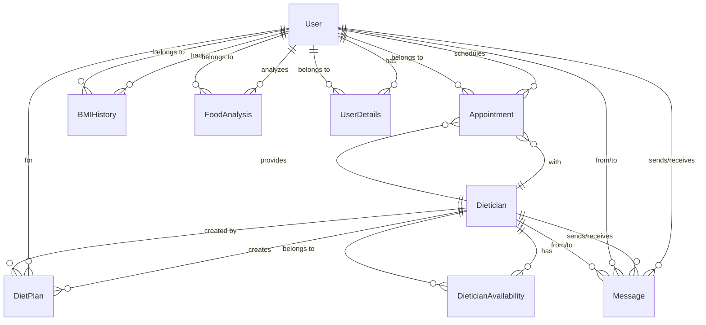

# Entity Relationship Diagram - Health & Diet Consultation Platform

## Overview

This document presents the complete entity relationship diagram for the Health & Diet Consultation Platform, showing all entities, their attributes, and relationships.

## Entity List

1. **User**
2. **Dietician**
3. **Appointment**
4. **Message**
5. **BMIHistory**
6. **FoodAnalysis**
7. **DietPlan**
8. **DieticianAvailability**
9. **UserDetails**

---

## Entity Details

### 1. User Entity

**Description**: Represents end users seeking diet consultation services

| Attribute       | Type       | Constraints            | Description                    |
| --------------- | ---------- | ---------------------- | ------------------------------ |
| `_id`           | ObjectId   | Primary Key            | Unique identifier              |
| `name`          | String     | Required               | Full name of user              |
| `email`         | String     | Unique, Required       | Email address                  |
| `password`      | String     | Required               | Hashed password                |
| `age`           | Number     | Optional               | Age in years                   |
| `weight`        | Number     | Optional               | Current weight in kg           |
| `height`        | Number     | Optional               | Height in cm                   |
| `gender`        | String     | Optional               | Gender identity                |
| `healthRecords` | [String]   | Optional               | Array of health record strings |
| `appointments`  | [ObjectId] | References Appointment | User's appointments            |
| `chatHistory`   | [ObjectId] | References Message     | User's chat messages           |

---

### 2. Dietician Entity

**Description**: Represents registered dieticians providing consultation services

| Attribute         | Type       | Constraints            | Description                 |
| ----------------- | ---------- | ---------------------- | --------------------------- |
| `_id`             | ObjectId   | Primary Key            | Unique identifier           |
| `name`            | String     | Required               | Full name of dietician      |
| `email`           | String     | Unique, Required       | Email address               |
| `password`        | String     | Required               | Hashed password             |
| `specialization`  | String     | Optional               | Area of specialization      |
| `experienceYears` | Number     | Optional               | Years of experience         |
| `qualifications`  | String     | Optional               | Educational qualifications  |
| `bio`             | String     | Optional               | Professional biography      |
| `availableSlots`  | [Object]   | Optional               | Available appointment slots |
| `appointments`    | [ObjectId] | References Appointment | Dietician's appointments    |
| `chatHistory`     | [ObjectId] | References Message     | Dietician's chat messages   |
| `dietPlans`       | [ObjectId] | References DietPlan    | Created diet plans          |

---

### 3. Appointment Entity

**Description**: Represents scheduled appointments between users and dieticians

| Attribute   | Type     | Constraints                                    | Description               |
| ----------- | -------- | ---------------------------------------------- | ------------------------- |
| `_id`       | ObjectId | Primary Key                                    | Unique identifier         |
| `user`      | ObjectId | Required, References User                      | Associated user           |
| `dietician` | ObjectId | Required, References Dietician                 | Associated dietician      |
| `date`      | Date     | Required                                       | Appointment date          |
| `timeSlot`  | String   | Required                                       | Time slot for appointment |
| `notes`     | String   | Optional                                       | Additional notes          |
| `plan`      | String   | Optional                                       | Diet plan details         |
| `status`    | String   | Enum: pending, confirmed, completed, cancelled | Appointment status        |
| `createdAt` | Date     | Auto-generated                                 | Creation timestamp        |
| `updatedAt` | Date     | Auto-generated                                 | Last update timestamp     |

---

### 4. Message Entity

**Description**: Represents chat messages between users and dieticians

| Attribute    | Type     | Constraints       | Description            |
| ------------ | -------- | ----------------- | ---------------------- |
| `_id`        | ObjectId | Primary Key       | Unique identifier      |
| `senderId`   | ObjectId | Required          | ID of message sender   |
| `receiverId` | ObjectId | Required          | ID of message receiver |
| `content`    | String   | Optional          | Message content        |
| `timestamp`  | Date     | Default: Date.now | Message timestamp      |

---

### 5. BMIHistory Entity

**Description**: Tracks user's BMI history over time

| Attribute   | Type     | Constraints               | Description           |
| ----------- | -------- | ------------------------- | --------------------- |
| `_id`       | ObjectId | Primary Key               | Unique identifier     |
| `user`      | ObjectId | Required, References User | Associated user       |
| `bmi`       | Number   | Required                  | BMI value             |
| `date`      | Date     | Default: Date.now         | Record date           |
| `createdAt` | Date     | Auto-generated            | Creation timestamp    |
| `updatedAt` | Date     | Auto-generated            | Last update timestamp |

---

### 6. FoodAnalysis Entity

**Description**: Stores nutritional analysis of food items

| Attribute   | Type     | Constraints               | Description              |
| ----------- | -------- | ------------------------- | ------------------------ |
| `_id`       | ObjectId | Primary Key               | Unique identifier        |
| `userId`    | ObjectId | Required, References User | Associated user          |
| `imageUrl`  | String   | Required                  | URL of food image        |
| `food`      | String   | Required                  | Food name/description    |
| `calories`  | Number   | Required, Min: 0          | Caloric content          |
| `proteins`  | Number   | Required, Min: 0          | Protein content (g)      |
| `carbs`     | Number   | Required, Min: 0          | Carbohydrate content (g) |
| `fats`      | Number   | Required, Min: 0          | Fat content (g)          |
| `fiber`     | Number   | Required, Min: 0          | Fiber content (g)        |
| `createdAt` | Date     | Auto-generated            | Creation timestamp       |
| `updatedAt` | Date     | Auto-generated            | Last update timestamp    |

---

### 7. DietPlan Entity

**Description**: Represents personalized diet plans created by dieticians

| Attribute     | Type     | Constraints          | Description        |
| ------------- | -------- | -------------------- | ------------------ |
| `_id`         | ObjectId | Primary Key          | Unique identifier  |
| `userId`      | ObjectId | References User      | Target user        |
| `dieticianId` | ObjectId | References Dietician | Creating dietician |
| `planDetails` | Object   | Optional             | Detailed diet plan |
| `duration`    | String   | Optional             | Plan duration      |
| `goals`       | [String] | Optional             | Plan objectives    |

---

### 8. DieticianAvailability Entity

**Description**: Tracks dietician availability slots

| Attribute     | Type     | Constraints          | Description          |
| ------------- | -------- | -------------------- | -------------------- |
| `_id`         | ObjectId | Primary Key          | Unique identifier    |
| `dieticianId` | ObjectId | References Dietician | Associated dietician |
| `date`        | Date     | Required             | Available date       |
| `timeSlots`   | [String] | Required             | Available time slots |
| `isBooked`    | Boolean  | Default: false       | Booking status       |

---

### 9. UserDetails Entity

**Description**: Extended user profile information

| Attribute        | Type     | Constraints     | Description           |
| ---------------- | -------- | --------------- | --------------------- |
| `_id`            | ObjectId | Primary Key     | Unique identifier     |
| `userId`         | ObjectId | References User | Associated user       |
| `additionalInfo` | Object   | Optional        | Extended profile data |

---

## Relationship Diagram

## Key Relationships

### One-to-Many Relationships:

- **User → Appointments**: One user can have multiple appointments
- **User → BMIHistory**: One user can have multiple BMI records
- **User → FoodAnalysis**: One user can have multiple food analyses
- **User → Messages**: One user can send/receive multiple messages
- **Dietician → Appointments**: One dietician can have multiple appointments
- **Dietician → DietPlans**: One dietician can create multiple diet plans
- **Dietician → Messages**: One dietician can send/receive multiple messages

### Many-to-One Relationships:

- **Appointment → User**: Each appointment belongs to one user
- **Appointment → Dietician**: Each appointment is with one dietician
- **BMIHistory → User**: Each BMI record belongs to one user
- **FoodAnalysis → User**: Each food analysis belongs to one user

### Many-to-Many Relationships:

- **User ↔ Dietician**: Through appointments and messages
- **User ↔ Dietician**: Through chat history

## Database Indexes

- **User.email**: Unique index for email lookup
- **Dietician.email**: Unique index for email lookup
- **FoodAnalysis.userId**: Index for user-based queries
- **BMIHistory.userId**: Index for user-based queries
- **Appointment.user**: Index for user appointment queries
- **Appointment.dietician**: Index for dietician appointment queries

## Entity Cardinality Summary

| Entity       | Count | Relationships         |
| ------------ | ----- | --------------------- |
| User         | 1     | → Many Appointments   |
| User         | 1     | → Many BMIHistory     |
| User         | 1     | → Many FoodAnalysis   |
| User         | 1     | → Many Messages       |
| Dietician    | 1     | → Many Appointments   |
| Dietician    | 1     | → Many DietPlans      |
| Dietician    | 1     | → Many Messages       |
| Appointment  | Many  | → 1 User, 1 Dietician |
| Message      | Many  | → 1 User/Dietician    |
| BMIHistory   | Many  | → 1 User              |
| FoodAnalysis | Many  | → 1 User              |
