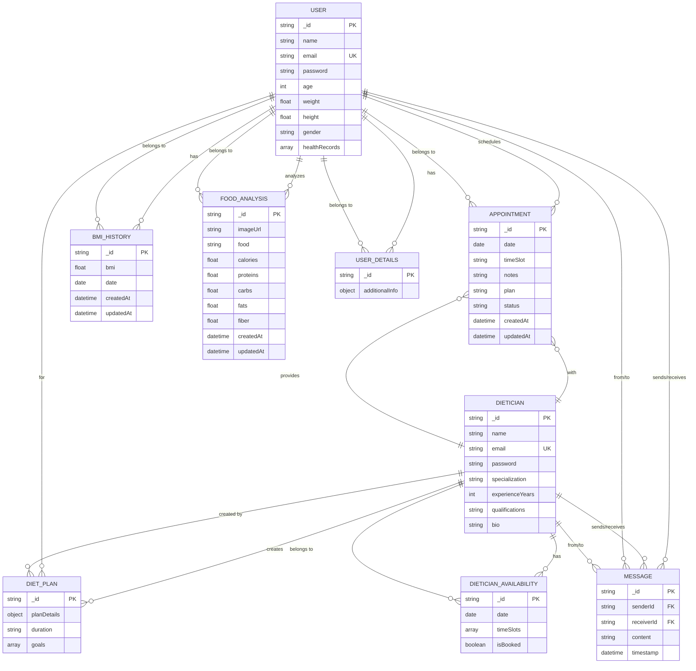

# ER Diagram with Shapes - Health & Diet Consultation Platform

## Entity Relationship Diagram (Standard ER Notation)



## Shape Legend

### Entity Shapes:

- **Rectangle (□)**: Represents entities (User, Dietician, etc.)
- **Diamond (◇)**: Represents relationships between entities
- **Oval (○)**: Represents attributes of entities

### Cardinality Symbols:

- **||**: One and only one
- **o{**: Zero or many
- **}|**: Many to one

### Key Symbols:

- **PK**: Primary Key (underlined)
- **FK**: Foreign Key (italic)
- **UK**: Unique Key (double underline)

## Visual ER Diagram with Shapes

### High-Level Overview

```
┌─────────────────┐          ┌──────────────────┐
│      USER       │          │    DIETICIAN     │
├─────────────────┤          ├──────────────────┤
│ _id (PK)        │          │ _id (PK)         │
│ name            │          │ name             │
│ email (UK)      │          │ email (UK)       │
│ password        │          │ password         │
│ age             │          │ specialization   │
│ weight          │          │ experienceYears  │
│ height          │          │ qualifications   │
│ gender          │          │ bio              │
│ healthRecords   │          │                  │
└─────────────────┘          └──────────────────┘
         │                            │
         │                            │
         │                            │
    ┌────┴────┐                  ┌────┴────┐
    │         │                  │         │
    ▼         ▼                  ▼         ▼
┌─────────────────┐    ┌─────────────────┐    ┌─────────────────┐
│   APPOINTMENT   │    │     MESSAGE     │    │   BMI_HISTORY   │
├─────────────────┤    ├─────────────────┤    ├─────────────────┤
│ _id (PK)        │    │ _id (PK)        │    │ _id (PK)        │
│ user (FK)       │    │ senderId (FK)   │    │ user (FK)       │
│ dietician (FK)  │    │ receiverId (FK) │    │ bmi             │
│ date            │    │ content         │    │ date            │
│ timeSlot        │    │ timestamp       │    │ createdAt       │
│ notes           │    │                 │    │ updatedAt       │
│ plan            │    │                 │    │                 │
│ status          │    │                 │    │                 │
│ createdAt       │    │                 │    │                 │
│ updatedAt       │    │                 │    │                 │
└─────────────────┘    └─────────────────┘    └─────────────────┘
```

### Relationship Flow

```
USER ────┬──────────────┬──────────────┬──────────────┐
         │              │              │              │
         ▼              ▼              ▼              ▼
   APPOINTMENT     BMI_HISTORY   FOOD_ANALYSIS    MESSAGE
         ▲              ▲              ▲              ▲
         │              │              │              │
DIETICIAN ────┬──────────────┬──────────────┬──────────────┐
              │              │              │              │
              ▼              ▼              ▼              ▼
        APPOINTMENT     DIET_PLAN    DIETICIAN_AVAILABILITY  MESSAGE
```

## Color-Coded ER Diagram

### Entity Colors:

- **Blue**: User-related entities
- **Green**: Dietician-related entities
- **Orange**: Appointment/Scheduling entities
- **Purple**: Health tracking entities
- **Red**: Communication entities

### Relationship Colors:

- **Solid lines**: Strong relationships (mandatory)
- **Dashed lines**: Weak relationships (optional)
- **Bold lines**: Identifying relationships

## Usage Instructions

1. **View the diagram**: Open `er-diagram-shapes.md` in any Markdown viewer
2. **Edit entities**: Modify the Mermaid code to add/remove attributes
3. **Update relationships**: Change cardinality symbols as needed
4. **Export**: Use Mermaid tools to export as PNG/SVG/PDF

## Additional Resources

- **Mermaid Live Editor**: https://mermaid.live
- **ER Diagram Tools**: dbdiagram.io, draw.io
- **Database Design**: Use this as reference for creating actual database schema
